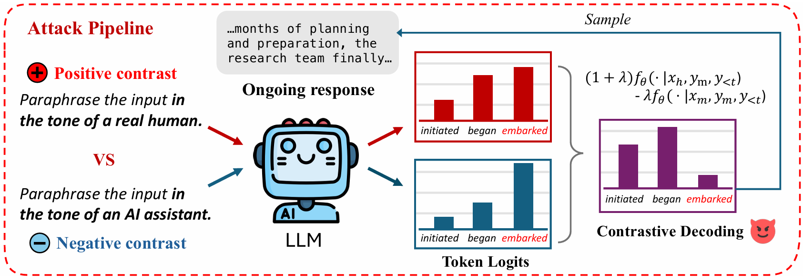
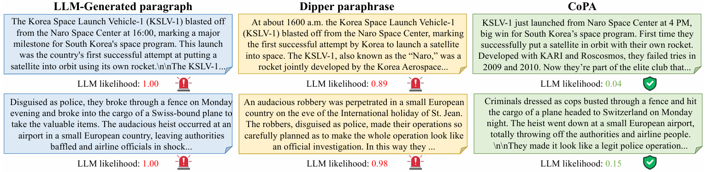

# Your Language Model Can Secretly Write Like Humans: Contrastive Paraphrase Attacks on LLM-Generated Text Detectors
A PyTorch official implementation for [Your Language Model Can Secretly Write Like Humans: Contrastive Paraphrase Attacks on LLM-Generated Text Detectors](https://arxiv.org/pdf/2505.15337), in EMNLP 2025.

[Hao Fang*](https://scholar.google.com/citations?user=12237G0AAAAJ&hl=en),
[Jiawei Kong*](https://scholar.google.com/citations?user=enfcklIAAAAJ&hl=en), 
[Tianqu Zhuang](https://github.com/ZhuangQu),
[Yixiang Qiu](https://scholar.google.com/citations?user=kxotrxgAAAAJ&hl=en),
[Kuofeng Gao](https://scholar.google.com/citations?user=0hVZ0woAAAAJ&hl=en),
[Bin Chen#](https://scholar.google.com/citations?user=Yl0wv7AAAAAJ&hl=en),
[Shu-Tao Xia](https://scholar.google.com/citations?user=koAXTXgAAAAJ&hl=en),
[Yaowei Wang](https://scholar.google.com/citations?user=o_DllmIAAAAJ&hl=en),
[Min Zhang](https://scholar.google.com/citations?user=CncXH-YAAAAJ&hl=en)

## Overview


<b>Abstract:</b> The misuse of large language models (LLMs), such as academic plagiarism, has driven the development of detectors to identify LLM generated texts. To bypass these detectors, paraphrase attacks have emerged to purposely rewrite these texts to evade detection. Despite the success, existing methods require substantial data and computational budgets to train a specialized paraphraser, and their attack efficacy greatly reduces when faced with advanced detection algorithms. To address this, we propose Contrastive Paraphrase Attack (CoPA), a training-free method that effectively deceives text detectors using off-the-shelf LLMs. The first step is to carefully craft instructions that encourage LLMs to produce more human-like texts. Nonetheless, we observe that the inherent statistical biases of LLMs can still result in some generated texts carrying certain machine like attributes that can be captured by detectors. To overcome this, CoPA constructs an auxiliary machine-like word distribution as a contrast to the human-like distribution generated by the LLM. By subtracting the machine-like patterns from the human-like distribution during the decoding process, CoPA is able to produce sentences that are less discernible by text detectors. Our theoretical analysis suggests the superiority of the proposed attack. Extensive experiments validate the effectiveness of CoPA in fooling text detectors across various scenarios.


## Visualization


## Setup
### Install dependencies
Setup Python environment:
```bash
conda create -n CoPA python=3.11.7
conda activate CoPA
pip install -r requirement.txt
pip install -e transformers
```  
### Prepare the SIM model and paraphraser

- Download the [SIM model](https://drive.google.com/drive/folders/1rOOYF3ioDD_Nm0sduhD6ZE1xdUQQKqvG), and place it in the `paraphrase-at-scale` dictionary.

- Download the paraphraser [Qwen2.5-72B-Instruct](https://huggingface.co/Qwen/Qwen2.5-72B-Instruct).

## Running commands

### Paraphrasing
Below we provide running commands for paraphrasing the Xsum dataset with Qwen2.5-72B-Instruct. The raw dataset is located in the `data/raw_data` dictionary.


```python
bash paraphrase.sh xsum
```

The paraphrased result is provided in the `data/results` dictionary.

### Evaluating

Below we provide running commands for testing our method on Xsum against Fast-DetectGPT:

```python
bash evaluate.sh data/results/xsum_qwen2.5-72b_gpt-3.5-turbo_lambda_0.5_alpha_1e-05_temperature_1.0_max_tries_10_paraphrase.raw_data.json fdgpt
```

## Cite
```python
@article{fang2025your,
  title={Your Language Model Can Secretly Write Like Humans: Contrastive Paraphrase Attacks on LLM-Generated Text Detectors},
  author={Fang, Hao and Kong, Jiawei and Zhuang, Tianqu and Qiu, Yixiang and Gao, Kuofeng and Chen, Bin and Xia, Shu-Tao and Wang, Yaowei and Zhang, Min},
  journal={arXiv preprint arXiv:2505.15337},
  year={2025}
}
```
